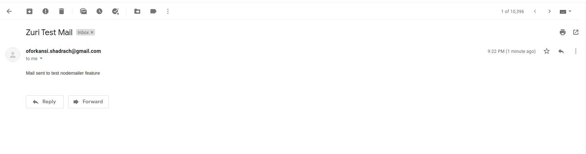

# Mailing Service With Node

This is a service that uses nodemailer package to send mails to desired recipients.

## setup

1. clone the repository using `git clone <repository_url>`
2. cd into the cloned directory
3. install the dependencies using `npm install`
4. create a .env file and using the .env.sample file as a template, fill in the details
5. run the dev server using `npm run dev`

## Usage

Mails can be sent to desired recipients by making a POST request to '/mails' endpoint with the following body:

``` json
{
  "to": "recipient_mail",
  "subject": "subject of the mail",
  "body": "plain text body of the mail"
}
```

## screenshot

A screenshot of sample mail sent during testing is avalaible


